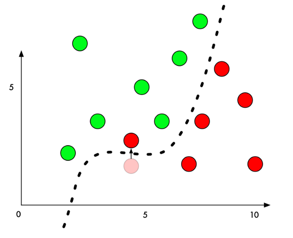

# 对抗样本的基本原理
## 概述
对抗样本是机器学习模型的一个有趣现象，攻击者通过在源数据上增加人类无法通过感官辨识到的细微改变，但是却可以让机器学习模型接受并做出错误的分类决定。以经典的二分类问题为例，机器学习模型通过在样本上训练，学习出一个分割平面，在分割平面的一侧的点都被识别为类别一，在分割平面的另外一侧的点都被识别为类别二。

生成攻击样本时，我们通过某种算法，针对指定的样本计算出一个变化量，该样本经过修改后，从人类的感觉无法辨识，但是却可以让该样本跨越分割平面，导致机器学习模型的判定结果改变。

如何高效的生成对抗样本，且让人类感官难以察觉，正是对抗样本生成算法研究领域的热点。

## 梯度算法和损失函数
对抗样本其实对机器学习模型都有效，不过研究的重点还是在神经网络尤其是深度学习网络领域。理解对抗样本算法，需要一定的神经网络的知识。

要很好理解针对图像分类模型的攻击，需要重温下梯度算法和损失函数。在深度学习模型里面，经常需要使用梯度算法，针对损失函数的反馈不断调整各层的参数，使得损失函数最小化。损失函数可以理解为理想和现实之间的差距，通常定义一个函数来描述真实值和预测值之间的差异，在训练阶段，真实值就是样本对应的真实标签和预测值就是机器学习模型预测的标签值，这些都是明确的，所以损失函数是可以定义和计算的。机器学习模型训练的过程就是不断调整参数追求损失函数最小的过程。梯度可以理解为多元函数的指定点上升的坡度，假设多元函数可以表示为f(x,y)，那么对应的梯度的定义为：
	

可见梯度可以用偏导数来定义，通常损失函数就是这个多元函数，特征向量就可以看成这个多元函数的某个点。在训练过程中，针对参数的调整可以使用梯度和学习率来定义，其中学习率也叫做学习步长，物理含义就是变量在梯度方向上移动的长度，学习率是一个非常重要的参数，过大会导致损失函数的震荡难以收敛，过小会导致计算缓慢，目前还没有很成熟的理论来推倒最合适的学习率，经验值是0.001-0.1之间。以表示学习率，那么迭代更新参数x的方法为：

当我们求函数的最大值时，我们会向梯度向上的方向移动，所以使用加号，也成为梯度向上算法。如果我们想求函数的最小值时，则需要向梯度向下的方向移动，也成为梯度下降算法。所以使用减号，比如求损失函数最小值是，对应迭代求解的方法为：

我们通过一个非常简单的例子演示这个过程，假设我们只有一个变量x，对应的损失函数定义为：

	根据梯度的定义，可以获得对应的梯度为：

  我们随机初始化x，学习率设置为0.1，整个过程如下：
  
	def demo():
		import random
		a=0.1
		x=random.randint(1,10)
		y = x * x + 2
		index=1
		while index < 100 and abs(y-2) > 0.01 :
    		y=x*x+2
    		print "batch={} x={} y={}".format(index,x,y)
    		x=x-2*x*a
    		index+=1

整个迭代过程最多100步，由于我们预先知道函数的最小值为2，所以如果当计算获得的函数值非常接近2，我们也可以提前退出迭代过程，比如绝对值相差不超过0.01。最后果然没让我们失望，在迭代20次后就找到了接近理论上的最小点。

	batch=14 x=0.329853488333 y=2.10880332377
	batch=15 x=0.263882790666 y=2.06963412721
	batch=16 x=0.211106232533 y=2.04456584141
	batch=17 x=0.168884986026 y=2.02852213851
	batch=18 x=0.135107988821 y=2.01825416864
	batch=19 x=0.108086391057 y=2.01168266793
	batch=20 x=0.0864691128455 y=2.00747690748

Keras里面提供相应的工具返回loss函数关于variables的梯度，variables为张量变量的列表，这里的loss函数即损失函数。

	from keras import backend as K
	k.gradients(loss, variables)

Keras也提供了function用于实例化一个Keras函数，inputs是输入列表列表，其元素为占位符或张量变量，outputs为输出张量的列表

	k.function(inputs, outputs, updates=[])

# 参考文献

- https://medium.com/@ageitgey/machine-learning-is-fun-part-8-how-to-intentionally-trick-neural-networks-b55da32b7196